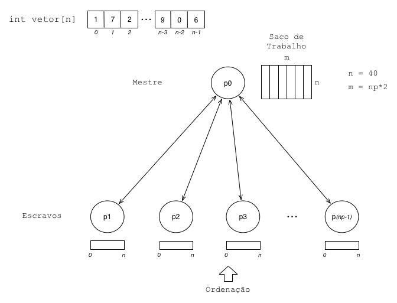

# Enunciado do Trabalho

## Objetivo

Implementar, usando a biblioteca MPI, uma versao paralela seguindo o modelo coordenador/trabalhador, do problema utilizado no primeiro trabalho de OpenMP (ou um novo problema caso o utilizado nao seja adequado). Cada grupo deve entregar um relatorio em .pdf de uma pagina com a analise dos resultados, com o codigo em anexo (seguir o modelo proposto).

## Modelo coordenador/trabalhador

O coordenador (mestre) ficara responsavel pela gerencia do saco de trabalho (normalmente uma matriz), distribuindo as unidades de trabalho (normalmente vetores) para os trabalhadores e recebendo de volta os vetores processados, guardando-os novamente no saco. A recepcao deve ser por ordem de chegada, ou seja, de quem ficar pronto primeiro. A ordem original dos vetores no saco deve ser mantida.

Os trabalhadores, por sua vez, recebem os vetores a serem processados, realizam o processamento com o algoritmo fornecido e retornam o vetor para o mestre. A iniciativa deve ser dos trabalhadores, ou seja, eles que pedem trabalho ao coordenador, que vai atendendo estas demandas ate que o saco esteja vazio. Neste momento sao enviadas mensagens de termino aos trabalhadores. O programa SPMD deve funcionar para qualquer numero de trabalhadores, permitindo a analise da curva de speed-up e eficiencia.

## Itens para avaliacao

- Execucao da versao sequencial.
- Implementacao da versao paralela SPMD do algoritmo em C e MPI, seguindo o modelo coordenador/trabalhador.
- Medicao dos tempos de execucao para a versao sequencial (em maquina do aluno ou laboratorio) e da versao paralela (usando 2 nos exclusivos da maquina Atlantica totalizando 16 e 32 processos; cada no possui 8 processadores capazes de executar 16 threads).
- Calculo do speed-up (forte e fraco) e da eficiencia para o caso de teste e diferentes numeros de processadores.
- Analise do balanceamento da carga na execucao do programa paralelo.
- Clareza do codigo (utilizacao de comentarios e nomes de variaveis adequadas).
- Relatorio em .pdf com uma pagina (coluna dupla), graficos e tabelas em anexo na segunda pagina e codigo a partir da terceira (sem limite).

---

Ultima atualizacao: quinta-feira, 14 mai. 2026, 18:40
